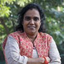
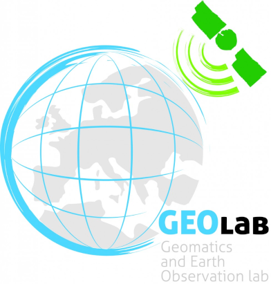

Credits 
========

.. image:: img/credits/Daniele.png
    :width: 160px
    :align: left

**Dr Daniele Oxoli**

Daniele Oxoli was born in Como, Italy, in 1990. He received the B.Sc. degree in civil and environmental engineering in 2013, and the M.Sc. degree in geomatics engineering in 2015 from the Politecnico di Milano, Milan, Italy. In 2019, he obtained his Ph.D. degree with honors in Geomatics Engineering from the Politecnico di Milano. He is currently assistant professor at the Geomatics and Earth Observation laboratory (GEOlab) of Politecnico di Milano and he is involved in a number of research projects connected to the use and development of Free and Open Source GIS software and the statistical analysis of spatial data. He is also a Charter Member of the Open Source Geospatial Foundation (`OSGeo <https://www.osgeo.org/>`_) and Secretary of the `ISPRS WG IV/7 <https://www2.isprs.org/commissions/comm4/wg7>`_ “Intelligent Systems in Sensor Web and IoT”. His research interests include spatial data analysis, spatial statistics, data science and visualization, and Earth Observation.

----------------------------------------------------------------------------------------------------------------------

.. image:: img/credits/Sheryl.png
    :width: 160px
    :align: left

**Dr Sheryl Rose C. Reyes**

Sheryl Rose C. Reyes is a Remote Sensing Expert at the United Nations Satellite Centre (UNOSAT) under the United Nations Institute for Training and Research (UNITAR). She received the M.Sc. degree in remote sensing and the B.Sc. degree in geodetic engineering from the University of the Philippines, Diliman. She was also one of the lead authors for the Global Environment Outlook 6 for Youth (GEO-6 for Youth) report, which is the first fully interactive e-publication of the United Nations Environment Programme (UNEP), written by youth for youth to inform, engage, educate, and lead youth towards environmental action. In addition to her professional experience, she was also the former President of the International Society for Photogrammetry and Remote Sensing Student Consortium (ISPRS SC) from 2016 - 2022, the representation of the youth and students in ISPRS. Her research interests include remote sensing, land cover change modeling, GIS and ecosystem services.

----------------------------------------------------------------------------------------------------------------------

**Dr Shu Peng**

National Geomatics Center of China, Beijing

----------------------------------------------------------------------------------------------------------------------

.. image:: img/credits/Maria.png
    :width: 160px
    :align: left

**Prof. Maria Antonia Brovelli**

Degree with honors in Physics, PhD in Geodesy and Cartography. She is Professor of “GIS” and “The Copernicus Green Revolution for sustainable development” at Politecnico di Milano (PoliMI) and a member of the School of Doctoral Studies in Data Science at “Roma La Sapienza” University. From 2006 to 2011 she lectured GIS at the ETH of Zurich and from 1997 to 2011 she was the Head of the Geomatics Laboratory of PoliMI (Campus Como). From 2011 to 2016 she was the Vice-Rector of PoliMI for the Como Campus. Currently, she is the coordinator of the Copernicus Academy Network for the PoliMI and the Head of the GEOLab, the Interdepartmental Lab where 7 Departments of POLIMI are contributing.
She is Vice President of the ISPRS Technical Commission on Spatial Information Science, former member of ESA ACEO (Advisory Committee of Earth Observation); co-chair of the United Nations Open GIS Initiative, chair of the UN-GGIM (Global Geospatial Information Management) Academic Network, mentor of the PoliMI Chapter of YouthMappers (PoliMappers), one of the three curators of the geospatial series of the AI for Good, organized by ITU in partnership with 40 UN Sister Agencies.
Her research activity is in the field of geomatics. Her interests have been various, starting from geodesy, radar-altimetry and moving later to GIS, webGIS, geospatial web platform, VGI, Citizen Science, Big Geo Data, geoAI. She is participating and leading research on these topics within the frameworks of both national and international projects and scientific networks. One of her main interests is in Open-Source GIS, where she is playing a worldwide leading role.

----------------------------------------------------------------------------------------------------------------------

**Prof. Serena Coetzee**

University of Pretoria, South Africa

----------------------------------------------------------------------------------------------------------------------

.. image:: img/credits/Ivana.png
    :width: 160px
    :align: left

**Dr Ivana Ivánová**

Dr Ivana Ivánová is a Senior Lecturer in Spatial Sciences and FrontierSI Research Fellow in Spatial Information Infrastructures. Her research interests and expertise are in spatial data quality spatial resources and spatial information infrastructures.
Dr Ivánová holds an engineering and doctoral degree, both from the Slovak University of Technology in Bratislava, in geodesy and cartography with specialization in Geoinformatics. She researched and lectured at several universities – Slovak University of Technology in Bratislava (2000-2007), University of Twente in the Netherlands (2007-2013) and São Paulo State University in Brazil (2014-2017).
Dr Ivánová has extensive experience in standardization. From 2004 - 2007, she represented the Slovak national standardization organization in the CEN/TC 287 Geographic information’s Outreach Group. She has been overseeing and reviewing the adaptation of ISO 19100 series of norms into a national legal framework for geographic information. She currently leads development of ISO 19157-1 and ISO 19157-3 standards on geographic information quality.
At ISO/TC211 Dr Ivánová is co-convening the Group on Ontology Maintenance and at Open Geospatial Consortium (OGC) she co-chairs the Data Quality Domain Working Group. Ivana represents Curtin University in the IT-004 Geographic information/Geomatics working group at Standards Australia. She regularly contributes to the work of several geospatial (incl. OSGeo, Geo4all, FOSS4G) and research (incl. RDA, ESIP and ARDC) communities.

----------------------------------------------------------------------------------------------------------------------

**Dr Darshana Rawal**

Has done PhD in Geography, M.Sc. in Geomatics and Master of computer Applications. She has 16 years of teaching and research experience. Her area of specialization is ‘Information Science and Geospatial Technology’. The specific application areas are Disaster, Health, Sustainable Environment, Urban Ecosystems that include City Planning, Infrastructure, Environment; IT-based web development, which are the key subjects of my expertise. She teaches various subjects named GIS, Web-GIS, Crowd Sourcing and Participatory-GIS, and Digital Image Processing. She is a member of various international Societies and organizations, those are: Member of the GeoforAll 2023; Co-Chair of WG V/3 Open Source Promotion and Web-based Resource Sharing; Member of the International Advisory Editorial Board of the Geo-Progress Journal; Member of the Scientific Council for the section "Methodological and Technical Issues of Geographic Information and Spatial Analysis; of GeoProgress Journal; Member, UN Open GIS Initiative of OSGeo, Member, FOSS4G an Academic/Scientific Track (AT) , First Prize for ‘Most Active Congress Contributor’ in XXIII ISPRS Congress, Prague, Czech Republic, 2016 and Excellence Award for a Project on'' Use of MongoDB for Social Media Database Management” during International Geoinformatics Summer School at Wuhan University, China, 2015.

----------------------------------------------------------------------------------------------------------------------

**Prof. Giuseppina Vacca**

University of Cagliari, Italy

----------------------------------------------------------------------------------------------------------------------

**Prof. Sisi Zlatanova**

University of New South Wales, Built Environment, Red Centre Building, Australia

----------------------------------------------------------------------------------------------------------------------

.. image:: img/credits/Julia.jpg
    :width: 160px
    :align: left

**Julia Anna Leonardi**

Julia was born in Warsaw, Poland, in 1998. She received her B.Sc. degree in Geography with specialization in geoinformatics from the University of Warsaw. Her B.Sc. thesis was on assessment of different Machine Learning algorithms on hyperspectral images for high mountain vegetation classification. She is now persuing a M.Sc. in Geoinformatics Engineering at Politecnico di Milano. 

----------------------------------------------------------------------------------------------------------------------

**Contacts**

Daniele Oxoli, PhD |br|
Politecnico di Milano - `GEOlab <https://www.gisgeolab.polimi.it/>`_ |br| 
Dept. of Civil and Environmental Engineering |br|
Building 3a, P.zza Leonardo da Vinci 32, 20133 Milano (IT) |br|
daniele.oxoli@polimi.it 

.. |br| raw:: html
    
   
